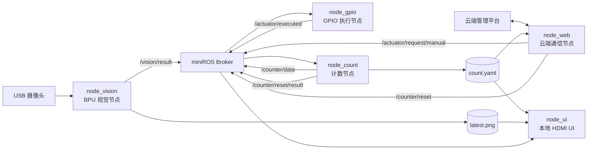

# RDK X5 智能垃圾分类系统

基于 **RDK X5、BPU、YOLOv8、miniROS、GPIO 和本地 HDMI UI** 实现的边缘智能垃圾分类系统。

系统从摄像头持续获取最新画面，仅在指定 ROI 内进行 BPU 推理；识别结果通过 miniROS 发送给 GPIO 执行节点，完成对应分类机构动作。动作成功后，计数节点更新本地持久化数据，并由本地 UI 和云端管理服务同步展示。

## 主要功能

- RDK X5 BPU 端侧 YOLOv8 推理
- 摄像头最新帧采集，减少缓存造成的画面延迟
- 仅对 ROI 区域推理，检测框还原至完整画面
- 多目标场景只处理置信度最高的目标
- 视觉目标全局最短 3 秒发送间隔
- 四类垃圾与 GPIO 分类机构控制
- 云端计数上报、远程手动投放和远程清零
- `count.yaml` 持久化计数、文件锁和原子写入
- miniROS 节点间解耦通信及自动重连
- 独立 HDMI 全屏 UI，显示视觉画面、识别状态和分类计数
- 一键启动、停止和日志管理

## 系统架构



## 节点说明

| 节点 | 入口文件 | 核心模块 | 职责 |
|---|---|---|---|
| miniROS Broker | `python3 -m miniROS` | miniROS | 负责节点连接和话题转发 |
| 计数节点 | `src/node_count.py` | `lib/counting.py` | GPIO 成功后计数、清零、持久化和计数发布 |
| GPIO 节点 | `src/node_gpio.py` | `lib/gpio_service.py` | 接收视觉或云端命令，控制四路 GPIO 并发布执行结果 |
| 云端节点 | `src/node_web.py` | `lib/cloud_service.py` | 计数上报、远程手动控制、远程清零和 ACK |
| 视觉节点 | `src/node_vision.py` | `lib/vision_service.py`、`lib/vision_bpu.py` | 摄像头采集、ROI 推理、类别映射和预览帧输出 |
| UI 节点 | `src/node_ui.py` | `lib/ui_service.py` | 显示完整视觉画面、计数、识别类别和坐标 |

## 节点对接关系

当前代码中的话题名称、发布者、订阅者和消息字段能够完整闭环。

| miniROS 话题 | 发布节点 | 订阅节点 | 主要字段 |
|---|---|---|---|
| `/vision/result` | `node_vision` | `node_gpio`、`node_ui` | `a`、`x`、`y`、`score`、`request_id` |
| `/actuator/request/manual` | `node_web` | `node_gpio` | `a`、`code`、`cloud_command_id` |
| `/actuator/executed` | `node_gpio` | `node_count`、`node_web` | `success`、`a`、`gpio`、`event_id`、`cloud_command_id` |
| `/counter/data` | `node_count` | `node_ui` | `counts`、`total`、`revision` |
| `/counter/reset` | `node_web` | `node_count` | `target`、`cloud_command_id` |
| `/counter/reset/result` | `node_count` | `node_web` | `success`、`counts`、`revision`、`cloud_command_id` |
| `/cloud/status` | `node_web` | 预留 | `enabled`、`online`、`last_error` |

### 自动识别链路

```text
摄像头
  → node_vision BPU 推理
  → /vision/result
  → node_gpio 执行对应 GPIO
  → /actuator/executed
  → node_count 增加计数
  → /counter/data
  → node_ui 显示并由 node_web 上报云端
```

### 云端手动控制链路

```text
云端 manual 命令
  → node_web
  → /actuator/request/manual
  → node_gpio
  → /actuator/executed
  → node_count 增加计数
  → node_web 向云端 ACK
```

### 云端清零链路

```text
云端 reset 命令
  → node_web
  → /counter/reset
  → node_count 更新 count.yaml
  → /counter/reset/result
  → node_web 向云端 ACK
```

## 垃圾类别映射

全局字段 `a` 是所有节点之间统一使用的垃圾类别编号。

| `a` | 类别 | 状态码 | GPIO | 当前 YOLO 类别 |
|---:|---|---|---:|---|
| `-1` | 无目标 | — | — | 未检测到目标 |
| `0` | 可回收垃圾 | `0001` | GPIO17 | `zhituan`、`pinggai` |
| `1` | 厨余垃圾 | `0010` | GPIO27 | 当前模型未配置视觉类别 |
| `2` | 有害垃圾 | `0100` | GPIO23 | `dianchi` |
| `3` | 其他垃圾 | `1000` | GPIO24 | `jiaodai` |

> 当前四类 YOLO 模型中没有厨余垃圾类别，因此 `a=1` 目前主要通过云端手动控制触发。后续增加厨余训练类别时，需要同步更新模型、`classes.names` 和 `vision.yolo_classes`。

## 消息示例

### 视觉识别结果

```json
{
  "a": 0,
  "x": 229,
  "y": 336,
  "score": 0.84,
  "yolo_class_id": 1,
  "yolo_class_name": "pinggai",
  "source": "vision",
  "timestamp": 1785701070.423,
  "request_id": "1785701070423099087-vision-a0"
}
```

未检测到目标时：

```json
{
  "a": -1,
  "x": -1,
  "y": -1,
  "source": "vision",
  "timestamp": 1785701070.423,
  "request_id": "1785701070423099087-vision-none"
}
```

### GPIO 执行结果

```json
{
  "a": 0,
  "x": 229,
  "y": 336,
  "code": "0001",
  "gpio": 17,
  "success": true,
  "error": "",
  "source": "vision",
  "request_id": "1785701070423099087-vision-a0",
  "cloud_command_id": null,
  "event_id": "1785701071427686167-a0",
  "finished_at": 1785701071.427
}
```

### 计数数据

```json
{
  "source": "node_count",
  "timestamp": 1785701071.430,
  "revision": 8,
  "counts": {
    "recyclable": 4,
    "kitchen": 1,
    "hazardous": 1,
    "other": 0
  },
  "total": 6,
  "updated_at": "2026-08-03T04:04:31+08:00",
  "last_action": "increment:a=0:recyclable"
}
```

## 项目目录

```text
all/
├── lib/
│   ├── core.py                 # 配置、YAML、miniROS 和类别映射公共能力
│   ├── counting.py             # 计数存储及计数节点
│   ├── gpio_service.py         # GPIO 执行节点
│   ├── cloud_service.py        # 云端 API 和远程控制节点
│   ├── vision_service.py       # 视觉业务逻辑
│   ├── vision_bpu.py           # YOLOv8 BPU 推理与摄像头底层
│   └── ui_service.py           # HDMI 图形界面
├── src/
│   ├── config.yaml             # 全局配置
│   ├── count.yaml              # 持久化计数数据
│   ├── node_count.py           # 计数节点入口
│   ├── node_gpio.py            # GPIO 节点入口
│   ├── node_web.py             # 云端节点入口
│   ├── node_vision.py          # 视觉节点入口
│   └── node_ui.py              # UI 节点入口
├── log/                        # 运行日志和 PID 文件
├── run_all.sh                  # 一键启动
├── stop_all.sh                 # 一键停止
└── README.md
```

## 运行环境

推荐使用 RDK X5 官方系统环境和系统 Python，不建议使用 Conda 运行板端程序。

参考测试环境：

| 项目 | 环境 |
|---|---|
| 开发板 | RDK X5 |
| Python | `/usr/bin/python3`，Python 3.10 |
| BPU Runtime | `hbm_runtime 1.24.5` |
| HBRT | `3.15.55` |
| 模型格式 | RDK X5 BPU `.bin` |
| 模型输入 | `640 × 640`，NV12 |
| 模型输出 | YOLOv8 六输出，stride 8/16/32 |
| 摄像头 | `/dev/video0`，请求 `1280 × 720 @ 30 FPS MJPG` |
| 图形界面 | Tkinter + X11/HDMI |

主要 Python 依赖：

- `miniROS`
- `opencv-python` 或系统 `cv2`
- `numpy`
- `hbm_runtime`
- `Hobot.GPIO`
- `tkinter`

其中 `hbm_runtime` 和 `Hobot.GPIO` 属于 RDK X5 板端组件，应使用开发板系统自带或官方提供的环境。

## 模型和标签文件

视觉配置默认使用以下外部文件：

```text
/home/sunrise/code/camera/best_bayese_640x640_nv12.bin
/home/sunrise/code/camera/classes.names
```

`classes.names` 顺序应为：

```text
zhituan
pinggai
dianchi
jiaodai
```

模型必须满足：

- 单输入
- 输入尺寸为偶数宽高，当前为 `640 × 640`
- NV12 输入
- YOLOv8 DFL，`reg_max=16`
- 六个输出，即三个分类输出和三个框回归输出
- 三个检测尺度对应 stride `8 / 16 / 32`

## 部署

当前启动脚本和部分配置使用固定目录：

```text
/home/sunrise/code/all
```

将项目复制到该目录：

```bash
sudo mkdir -p /home/sunrise/code
sudo cp -r all /home/sunrise/code/all
```

为启动脚本增加执行权限：

```bash
sudo chmod +x /home/sunrise/code/all/run_all.sh
sudo chmod +x /home/sunrise/code/all/stop_all.sh
```

安装 Tkinter 和中文字体：

```bash
sudo apt update
sudo apt install -y python3-tk fonts-noto-cjk
```

检查系统 Python 依赖：

```bash
/usr/bin/python3 -c "import miniROS"
/usr/bin/python3 -c "import cv2, numpy, hbm_runtime"
/usr/bin/python3 -c "import Hobot.GPIO"
/usr/bin/python3 -c "import tkinter"
```

## 启动与停止

### 启动全部服务

```bash
sudo /home/sunrise/code/all/run_all.sh
```

也可以显式通过 Bash 启动：

```bash
sudo bash /home/sunrise/code/all/run_all.sh
```

启动顺序为：

1. miniROS Broker
2. 计数节点
3. GPIO 节点
4. 云端节点
5. 视觉节点
6. HDMI UI 节点

### 停止全部服务

```bash
sudo /home/sunrise/code/all/stop_all.sh
```

### GPIO 无硬件测试模式

调试节点通信但不操作真实 GPIO：

```bash
sudo env SMARTBIN_GPIO_DRY_RUN=1 \
  /home/sunrise/code/all/run_all.sh
```

## 日志

日志位于：

```text
/home/sunrise/code/all/log/
```

实时查看全部业务日志：

```bash
tail -f /home/sunrise/code/all/log/{count,gpio,web,vision,ui}.log
```

分别查看：

```bash
tail -f /home/sunrise/code/all/log/vision.log
tail -f /home/sunrise/code/all/log/gpio.log
tail -f /home/sunrise/code/all/log/count.log
tail -f /home/sunrise/code/all/log/web.log
tail -f /home/sunrise/code/all/log/ui.log
```

## 配置说明

主要配置文件：

```text
src/config.yaml
```

### `paths`

定义计数文件、锁文件和 UI 预览帧路径。

```yaml
paths:
  count_yaml: "/home/sunrise/code/all/src/count.yaml"
  count_lock: "/tmp/rdk_smartbin_count.lock"
  latest_frame: "/dev/shm/rdk_smartbin_latest.png"
```

### `miniros`

配置 Broker 地址、端口、重连时间及全部话题。

### `garbage`

统一定义每种垃圾的：

- 全局编号 `a`
- 中文名称
- UI 名称
- 四位状态码
- BCM GPIO 编号

所有业务节点都从该部分读取映射，避免重复硬编码。

### `vision`

主要参数：

| 参数 | 说明 |
|---|---|
| `model_path` | BPU 模型路径 |
| `labels_path` | 标签文件路径 |
| `camera_index` | 摄像头编号 |
| `width`、`height`、`fps` | 摄像头请求参数 |
| `roi` | 推理区域，坐标基于摄像头实际输出画面 |
| `score_threshold` | 置信度阈值 |
| `nms_threshold` | NMS 阈值 |
| `target_cooldown_s` | 有目标消息发送间隔，代码保证不小于 3 秒 |
| `no_target_publish_s` | 无目标状态发送间隔 |
| `yolo_classes` | YOLO 类别到全局 `a` 的映射 |

### `control`

主要参数：

| 参数 | 说明 |
|---|---|
| `dry_run` | 是否仅打印 GPIO 动作 |
| `active_low_seconds` | GPIO 拉低时间 |
| `post_action_cooldown_s` | 动作完成后的冷却时间 |
| `queue_size` | GPIO 命令队列容量 |
| `result_cache_size` | 已执行命令结果缓存数量 |

### `cloud`

负责云端地址、认证信息、上报周期、命令轮询周期和执行等待时间。

公开仓库中的示例配置应使用占位值：

```yaml
cloud:
  enabled: false
  base_url: "https://example.com"
  device_id: "YOUR_DEVICE_ID"
  device_key: "YOUR_DEVICE_KEY"
  verify_tls: true
```

### `ui`

配置 HDMI 显示编号、窗口标题、全屏模式和刷新周期。当前 UI 始终读取并显示视觉预览帧；`show_camera` 字段尚未在代码中使用，可作为后续开关预留。

## 云端 API 约定

设备认证通过请求头传递：

```http
X-Device-ID: YOUR_DEVICE_ID
X-Device-Key: YOUR_DEVICE_KEY
```

### 计数上报

```http
POST /api/iot/v1/report
```

```json
{
  "recyclable": 4,
  "kitchen": 1,
  "hazardous": 1,
  "other": 0,
  "firmware": "rdk-x5-smartbin-4.0",
  "local_status": "running"
}
```

### 获取手动控制命令

```http
GET /api/iot/v1/commands?command_type=manual&limit=1
```

命令可通过 `a` 或四位 `code` 指定分类：

```json
{
  "commands": [
    {
      "command_id": "command-uuid",
      "payload": {
        "a": 1,
        "code": "0010"
      }
    }
  ]
}
```

### 获取清零命令

```http
GET /api/iot/v1/commands?command_type=reset&limit=1
```

`target` 支持：

- `all`
- `0`、`1`、`2`、`3`
- `0001`、`0010`、`0100`、`1000`
- `recyclable`、`kitchen`、`hazardous`、`other`
- 对应中文分类名称

### 命令 ACK

```http
POST /api/iot/v1/commands/{command_id}/ack
```

```json
{
  "success": true,
  "message": "执行成功"
}
```

## 计数文件

`src/count.yaml` 是本地计数的唯一持久化数据源。

```yaml
schema_version: 1
counts:
  recyclable: 0
  kitchen: 0
  hazardous: 0
  other: 0
total: 0
metadata:
  revision: 0
  updated_at: null
  updated_by: "bootstrap"
  last_action: "initialize"
  last_event_id: null
```

设计原则：

- 只有 `node_count` 可以写入
- UI 和云端节点只读
- GPIO 执行成功后才增加计数
- 使用 `fcntl` 文件锁保护并发访问
- 使用临时文件和 `os.replace()` 原子更新
- 文件格式异常时先备份，不静默清空历史数据

## 故障排查

### `/usr/bin/python3` 无法导入 `miniROS`

确保 miniROS 安装在系统 Python 环境，而不是仅安装在 Conda 环境。

```bash
/usr/bin/python3 -c "import miniROS; print(miniROS)"
```

### 无法打开摄像头

```bash
ls -l /dev/video*
v4l2-ctl --list-formats-ext -d /dev/video0
```

确认 `vision.camera_index` 与实际设备一致。

### BPU 提示输出数量错误

当前后处理仅支持 YOLOv8 六输出模型。若模型结构或输出顺序不同，需要同步调整 `vision_bpu.py`。

### UI 无法连接显示器

确认 RDK 桌面已登录，并检查：

```bash
echo "$DISPLAY"
ls -l /home/sunrise/.Xauthority
```

默认使用：

```text
DISPLAY=:0
XAUTHORITY=/home/sunrise/.Xauthority
```

### GPIO 没有动作

- 程序需要 root 权限
- 检查 BCM 编号是否与实际接线一致
- 检查执行器是否为低电平触发
- 先使用 `SMARTBIN_GPIO_DRY_RUN=1` 验证节点链路

### UI 显示旧画面

停止脚本会删除：

```text
/dev/shm/rdk_smartbin_latest.png
```

如果进程被异常终止，可手动删除该文件后重新启动。

## GitHub 发布前检查

公开仓库前必须处理以下内容：

1. 删除或替换 `src/config.yaml` 中真实的 `device_key`、`device_id` 和服务器地址。
2. 不要提交 `log/*.log` 和 `log/*.pid`。
3. 不要提交 `__pycache__/`、`*.pyc` 和调试产生的 `*.orig` 文件。
4. 确认模型文件是否允许公开发布；大模型文件建议使用 Git LFS 或在 Release 中单独提供。
5. 将 README 保存为 UTF-8 编码。

推荐 `.gitignore`：

```gitignore
__pycache__/
*.py[cod]
*.orig

log/*.log
log/*.pid

.env
.DS_Store
.vscode/
.idea/
```

## 接口验证状态

当前版本已经完成以下检查：

- Python 源码语法检查通过
- `run_all.sh` 和 `stop_all.sh` Shell 语法检查通过
- miniROS 全部话题名称一致
- 垃圾类别、状态码和 GPIO 映射一致
- 视觉结果能够进入 GPIO 节点
- GPIO 成功结果能够进入计数节点
- 相同 GPIO 请求能够复用结果且不会重复计数
- 云端手动命令能够收到 GPIO 执行 ACK
- 云端清零命令能够收到计数节点 ACK
- 计数和视觉消息能够更新 UI 状态
- 随项目提供的板端日志已记录实际摄像头、BPU、GPIO、计数、云端和 UI 节点运行结果
